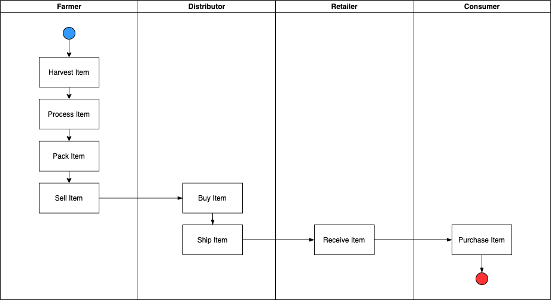
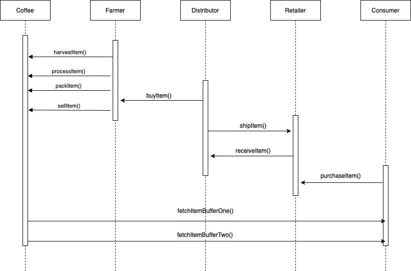
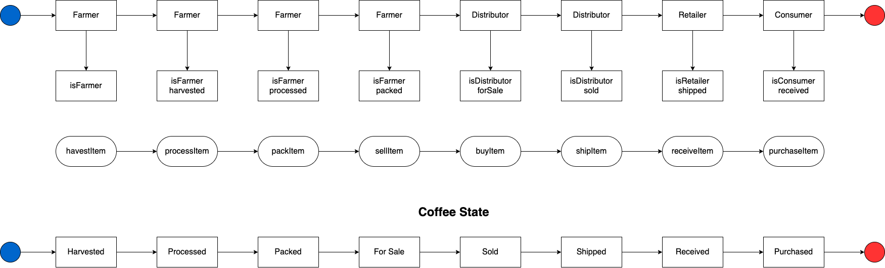
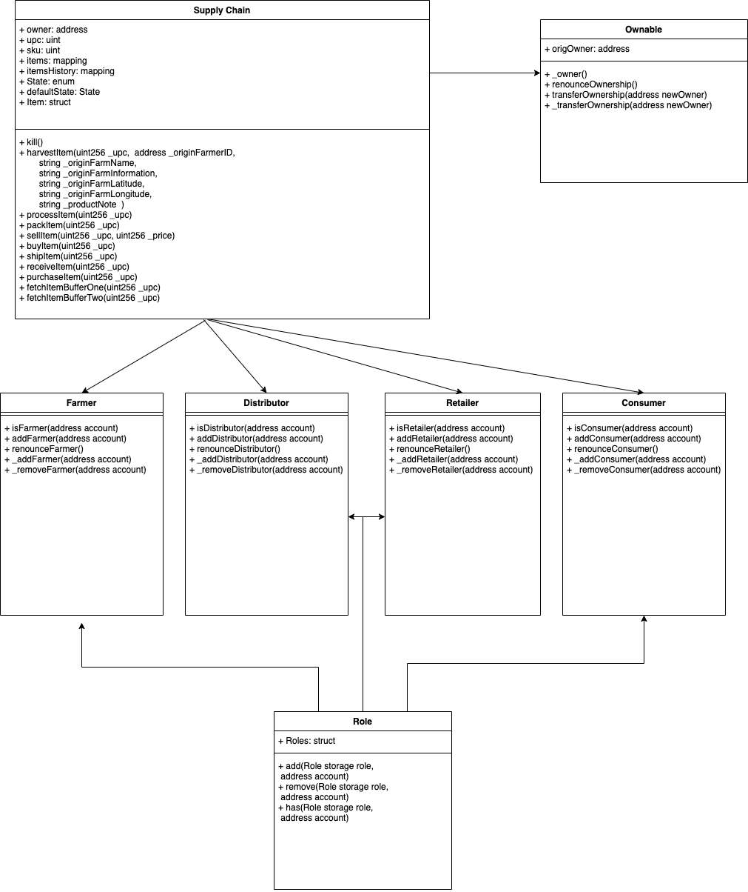

# Supply chain & data auditing

This repository containts an Ethereum DApp that demonstrates a Supply Chain flow between a Seller and Buyer. The user story is similar to any commonly used supply chain process. A Seller can add items to the inventory system stored in the blockchain. A Buyer can purchase such items from the inventory system. Additionally a Seller can mark an item as Shipped, and similarly a Buyer can mark an item as Received.

## Requirements

Token Address @ Rinkeby|[0x953D227F19527BBD29ecE8Ed2b9857cbcDDbb884](https://rinkeby.etherscan.io/address/0x953D227F19527BBD29ecE8Ed2b9857cbcDDbb884)

* Truffle
* Node
* [Infura Account](https://infura.io/)
* MetaMask Browser Add-on

Asset|Details
---|---
Truffle Version|v5.1.36
Solidity|v0.4.24 (solc-js)
Node|v10.15.3
Web3.js|v1.2.1
Packages added `truffle-hdwallet-provider` for rinkeby deployment

## Diagrams

## Activity Diagrams

## Sequence Diagrams

## State Diagrams

## Class Diagrams

